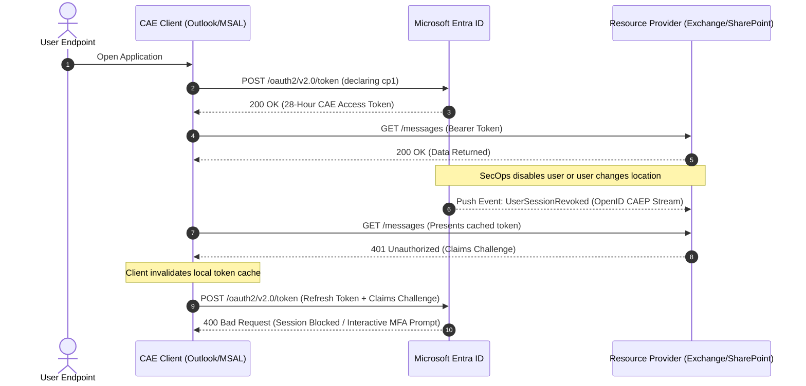

While working as an Identity and Access Administrator for an MSP, one of the most persistent security challenges we faced was the **"token lifetime gap."**

In traditional OAuth 2.0 architectures, once a user authenticates, Microsoft Entra ID issues an access token with a fixed 60-minute lifespan. During that 1-hour window, the resource provider (such as Exchange Online, SharePoint, or Teams) trusts the token cryptographically without checking back with Entra ID. If a user was terminated, their password reset, or an administrator manually revoked their sessions 2 minutes after login, the active token remained valid until its expiration clock ran out.

To solve this vulnerability, Microsoft implemented **Continuous Access Evaluation (CAE)** based on the open **OpenID Continuous Access Evaluation Profile (CAEP)** standard.

In this article, I want to demystify how CAE works under the hood, break down the client **Claims Challenge (`cp1`)** protocol, explore the nuances of **Strict Location Enforcement**, and highlight the real-world operational gotchas we learned in production.

---

## The Paradigm Shift: Static Expiry vs. Real-Time Revocation

Rather than issuing short-lived ephemeral tokens that flood authentication endpoints, CAE flips the model: Entra ID issues **long-lived tokens (up to 28 hours)** while maintaining a real-time backchannel event stream with Microsoft 365 services.

```mermaid
flowchart TD
    subgraph Traditional [Traditional OAuth 2.0 - 1-Hour Fixed Token]
        T1[User Authenticates] --> T2[1-Hour Access Token Issued]
        T2 --> T3[Admin Revokes Session / Disables Account]
        T3 -->|Security Gap: Up to 58 min| T4[Token Finally Expires]
    end

    subgraph Modern [Continuous Access Evaluation - CAE]
        C1[User Authenticates with cp1] --> C2[28-Hour Long-Lived Token Issued]
        C2 --> C3[Critical Event / Location Change Detected]
        C3 -->|Real-Time Backchannel Push| C4[Resource Provider Rejects Token]
        C4 --> C5[Client Forces Policy Re-Evaluation at Entra ID]
    end
```



### Why 28-Hour Tokens Are Actually More Secure

When administrators first see a 28-hour token duration, their initial reaction is often concern. However, this architecture provides two major security and resilience benefits:

1. **Near Real-Time Security Cutoff:** Instead of waiting for a 60-minute timer, the resource provider receives instant event notifications or checks real-time location tables, severing unauthorized access immediately.
2. **Outage & Throttle Resilience:** If Entra ID experiences transient regional authentication delays, users with active CAE sessions continue working in Outlook and Teams without hammering token endpoints.

---

## Under the Hood: The Claims Challenge Protocol (`cp1`)

CAE is a negotiated three-way handshake between the client application (e.g., Outlook, Teams, MSAL), the Identity Provider (Microsoft Entra ID), and the Resource Provider (Exchange, SharePoint, Graph).



### Step 1: Declaring Client Capability (`cp1`)
When a CAE-aware application requests a token, it sends a client capability parameter:

```json
{
  "access_token": {
    "xms_cc": {
      "values": ["cp1"]
    }
  }
}
```

### Step 2: The `401 Unauthorized` Claims Challenge
When a condition changes (e.g., the user is disabled or leaves an approved location), the resource provider rejects the cached token and returns an HTTP `401 Unauthorized` with a `WWW-Authenticate` header:

```http
HTTP/1.1 401 Unauthorized
WWW-Authenticate: Bearer error="insufficient_claims",
  claims="eyJhY2Nlc3NfdG9rZW4iOnsibmJmIjp7ImVzc2VudGlhbCI6dHJ1ZSwgInZhbHVlIjoiMTY5MzA1MDAwMCJ9LCJ4bXNfY2FlIjoxfX0="
```

### Step 3: Cache Invalidation & Re-Evaluation
The decoded claims challenge instructs the client library (MSAL/WAM) to invalidate its local cache and submit its refresh token to Entra ID. Entra ID re-evaluates all Conditional Access policies and either challenges the user for step-up MFA or blocks access entirely.

---

## Two Core Evaluation Triggers

CAE operates across two distinct evaluation channels:

| Dimension | 1. Critical Event Evaluation | 2. Conditional Access Location Evaluation |
| :--- | :--- | :--- |
| **Trigger Mechanism** | Event push stream from Entra ID to Resource Providers | IP Named Location tables synchronized into Resource Providers |
| **License Level** | Included in all Entra ID licenses (Free / P1 / P2) | Requires Entra ID P1 or P2 (Conditional Access) |
| **Evaluated Events** | • Account disabled or deleted<br>• Password reset or changed<br>• MFA enabled for user<br>• Admin explicitly revokes sessions<br>• **High User Risk** flagged by Entra ID Protection | • Real-time user egress IP movement outside allowed [Named Locations](post.html?file=an-approach-to-handling-travelling-users-within-entra-id.md) |
| **Enforcement Latency** | Near real-time (**< 15 minutes**) | **Instantaneous** on next HTTP request |

---

## The Network Dilemma: Standard vs. Strict Location Enforcement

One of the most common operational challenges with CAE occurs in environments utilizing **split-tunneling VPNs, Cloud Proxies, SD-WAN, and egress gateways**.


If authentication traffic goes through corporate proxy IP `1.1.1.1` (trusted), but direct M365 data traffic routes through home ISP IP `2.2.2.2` (untrusted), an **IP mismatch** occurs:

1. **Standard Location Enforcement (Default):**
   When Entra ID detects this split-path egress, it grants a compatibility exception: it issues a **1-hour fallback token** without instant IP enforcement. This prevents user lockouts while keeping critical directory event evaluation intact.
2. **Strict Location Enforcement:**
   Configured in *Conditional Access > Session Controls > Strictly enforce location policies*. Under Strict Mode, the 1-hour fallback is eliminated. If the IP seen by Exchange or SharePoint is not explicitly in an allowed Named Location, access is **immediately blocked**.

> **Pro Tip:** Only enable Strict Location Enforcement if your organization has 100% deterministic, documented, and fully mapped egress IP ranges across all M365 and Entra ID traffic routes.

---

## Real-World Operational Gotchas

Through deploying and managing CAE across enterprise tenants, here are the key operational gotchas you should watch for:

### 1. The 5,000 IP Range Threshold
If the total number of IPv4 and IPv6 CIDR subnets across your Conditional Access Named Locations exceeds **5,000 ranges**, CAE silently disables real-time location checking and reverts to standard 1-hour tokens (critical directory events still function).

### 2. B2B Guest Accounts
CAE real-time token revocation and location enforcement **do not apply to B2B Guest users**. External collaborator sessions remain subject to standard token lifetimes.

### 3. Office Coauthoring Session Linger
When multiple users actively collaborate on a Word or Excel document in SharePoint or OneDrive, active WebSocket/WAC locks remain open for up to 1 hour after revocation. To reduce this latency, adjust your SharePoint tenant settings:

```powershell
# Shorten coauthoring WAC token lifetime to 15 minutes
Set-SPOTenant -IPAddressWACTokenLifetime 15
```

### 4. Account Re-Enablement Latency Asymmetry
While disabling an account terminates access within minutes, **re-enabling an account** exhibits an architectural delay before downstream resource providers clear their cached revocation signals:
- **SharePoint Online & Teams:** ~15-minute propagation delay
- **Exchange Online:** ~35 to 40-minute propagation delay

### 5. Disabling WAM Breaks Client CAE
Legacy optimization scripts or registry tweaks that disable the Windows Web Account Manager (`DisableAADWAM = 1`) prevent desktop Office applications from handling claims challenges, causing authentication loops.

---

## Troubleshooting CAE in Sign-in Logs & KQL

To identify CAE IP mismatches and verify policy enforcement before turning on Strict Location controls, run this query in **Microsoft Sentinel** or **Entra Log Analytics**:

```kusto
// KQL Query: Detect CAE IP Mismatches between Auth & Resource Endpoints
SigninLogs
| where TimeGenerated > ago(7d)
| extend ResourceIP = tostring(parse_json(AuthenticationProcessingDetails)[0].value)
| where isnotempty(ResourceIP) and ResourceIP != IPAddress
| project TimeGenerated, UserPrincipalName, AppDisplayName, IPAddress, ResourceIP, ResultType, ResultDescription
| summarize MismatchCount = count() by UserPrincipalName, IPAddress, ResourceIP, AppDisplayName
| order by MismatchCount desc
```

### Forcing Immediate Manual Revocation via PowerShell
During incident response, you can immediately invalidate all active refresh tokens and signal CAE-aware endpoints:

```powershell
# Connect to Microsoft Graph PowerShell
Connect-MgGraph -Scopes "User.ReadWrite.All"

# Revoke active sign-in sessions and signal CAE endpoints
Revoke-MgUserSignInSession -UserId "alex.wilber@contoso.com"
```

---

## Summary & Recommendations

Continuous Access Evaluation transforms Microsoft Entra ID from a point-in-time gatekeeper into a dynamic, real-time access engine. 

To maximize its effectiveness:
- Keep Microsoft 365 client apps on **Current or Monthly Enterprise channels** to maintain `cp1` support.
- Audit your egress networking with the **Continuous Access Evaluation Insights Workbook** prior to enabling strict location controls.
- Educate your Service Desk on the 15–40 minute propagation window when re-enabling previously disabled user accounts.
