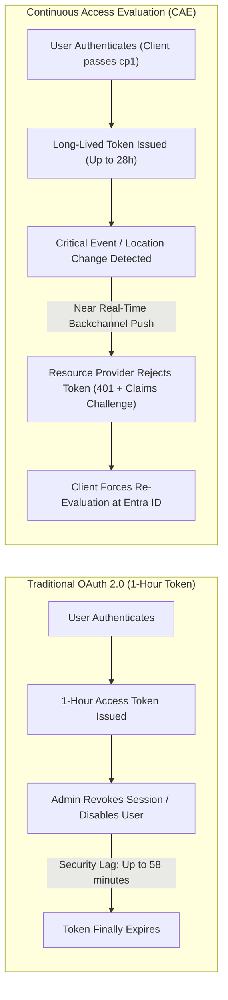
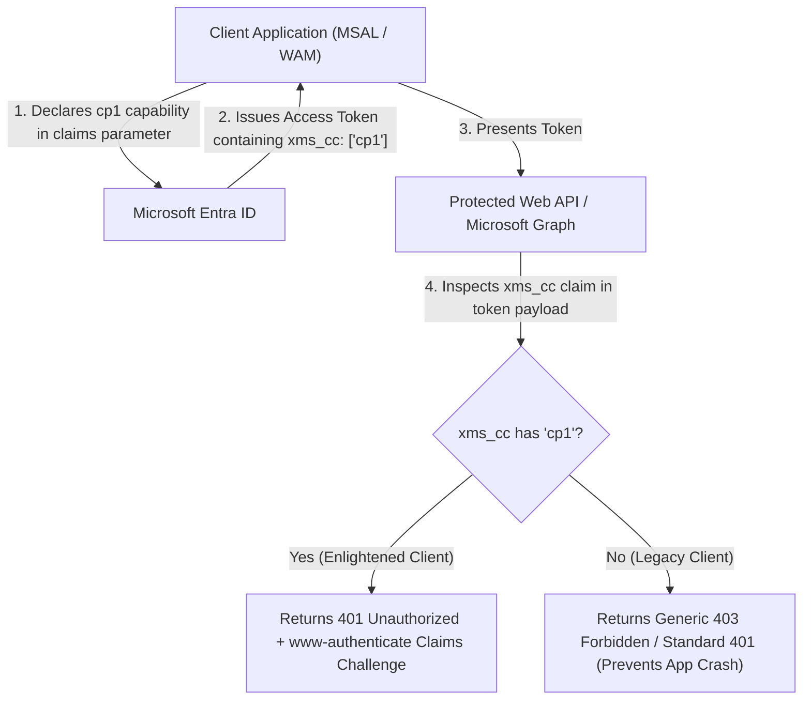
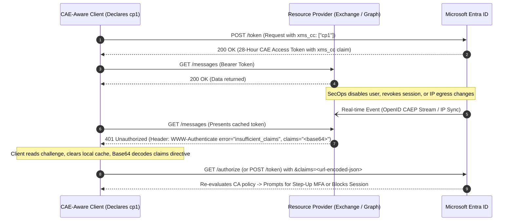
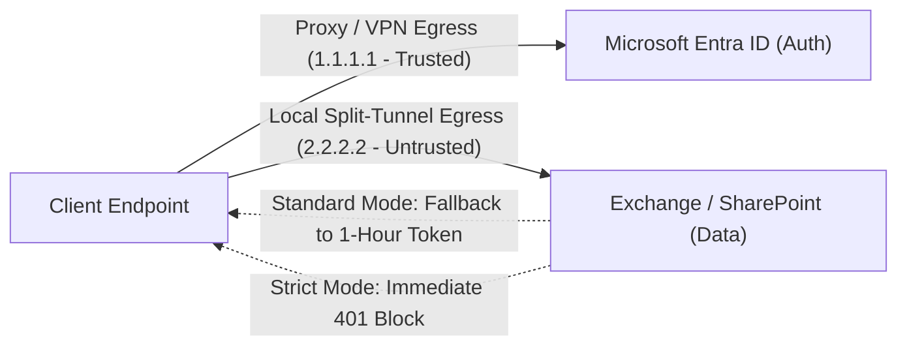

# Demystifying Continuous Access Evaluation (CAE) in Microsoft Entra ID: Claims Challenges, Strict Location & Real-World Gotchas (demystifying-continuous-access-evaluation.md)

> **Author:** Identity & Cloud Security Engineering
> 
> **Target Audience:** Identity Architects, SecOps, Enterprise Cloud Engineers, and M365 Administrators
> 
> **Topics:** Microsoft Entra ID, OpenID CAEP, Zero Trust, Conditional Access, Token Lifecycle

---

## Introduction

For over a decade, modern cloud authentication has operated under a fundamental compromise. In standard OAuth 2.0 implementations, access tokens are designed to be stateless and self-contained: once Microsoft Entra ID signs and mints an access token, downstream services like Exchange Online, SharePoint, and Microsoft Graph trust that token until its expiration timestamp expires—typically after 60 minutes.[1](#user-content-fn-msft-cae-overview) 

This model created an uncomfortable tension between security posture and operational resilience. If token lifetimes are made too short, authentication endpoints risk throttling, user experience degrades, and transient network blips turn into outages. If token lifetimes are made longer, the security exposure window widens: if an employee is terminated, an account compromised, or an unauthorized network change occurs immediately after sign-in, security teams are left waiting for an arbitrary timer to run down before access is severed.[1](#user-content-fn-msft-cae-overview)

**Continuous Access Evaluation (CAE)** fundamentally resolves this dilemma. Built on the open **OpenID Continuous Access Evaluation Profile (CAEP)** standard, CAE shifts the paradigm from passive, time-based token expiration to active, real-time event subscription and dynamic policy evaluation between Microsoft Entra ID and resource providers.[1](#user-content-fn-msft-cae-overview) [4](#user-content-fn-msft-cae-claims-challenges)

In this guide, we dive deep into how CAE operates under the hood: how long-lived tokens and the `cp1` claims challenge protocol work together, the delicate networking mechanics of standard versus strict location enforcement, and the practical operational edge cases every identity team should anticipate.

---

## 1. The Architectural Shift: Static Expiry vs. Real-Time Revocation

In classic OAuth 2.0, relying parties (Resource Providers like SharePoint or Exchange) evaluate access tokens offline using cryptography (validating signature and expiration `exp`).[1](#user-content-fn-msft-cae-overview) They have zero knowledge of directory changes until the client asks Entra ID for a token refresh.[1](#user-content-fn-msft-cae-overview)




### Why 28-Hour Tokens Are Actually More Secure

When engineers first hear that CAE tokens last up to **28 hours**, their initial reaction is often skepticism.[1](#user-content-fn-msft-cae-overview) However:

1. **Reduced Throttling & Outage Resilience:** When Entra ID experiences transient authentication delays or regional degradations, users with active CAE sessions continue working uninterrupted without hammering token issuance endpoints.[1](#user-content-fn-msft-cae-overview)
2. **Instant Security Cutoff:** Because the resource provider actively validates security events pushed by Entra ID, security enforcement happens in **near-real time (< 15 minutes for directory events, instant for IP changes)** rather than waiting for an arbitrary 60-minute clock to tick down.[1](#user-content-fn-msft-cae-overview)

---

## 2. Under the Hood: The Claims Challenge Protocol & What `cp1` Actually Is

CAE is not a one-sided server change; it requires the client application, the identity provider (Entra ID), and the resource provider (API) to negotiate a coordinated three-way handshake.[1](#user-content-fn-msft-cae-overview) [4](#user-content-fn-msft-cae-claims-challenges)

### What Exactly Is `cp1`? (Client Profile 1)

In Microsoft identity platform architecture, **`cp1`** stands for **Client Profile 1** (also referred to as *Client Capability 1* or *Claims Profile 1*).[4](#user-content-fn-msft-cae-claims-challenges) It is an explicit capability token string that tells Microsoft Entra ID and resource APIs:

> *"This client application is modern, enlightened, and fully capable of intercepting HTTP 401 claims challenges, clearing its local token cache, and prompting for re-authentication on the fly."*[4](#user-content-fn-msft-cae-claims-challenges)



### Why `cp1` Exists: The Backward Compatibility Safeguard

Why doesn't Microsoft Entra ID simply enable CAE and claims challenges for every client application by default?

* **The Breaking Change Risk:** In traditional OAuth 2.0, if an API suddenly returns an unexpected `HTTP 401 Unauthorized` with a `www-authenticate: Bearer error="insufficient_claims", claims="<base64>"` header, legacy client applications that do not understand claims challenges will treat the response as an unrecoverable fatal error.[4](#user-content-fn-msft-cae-claims-challenges) Many legacy apps enter infinite retry loops, freeze, or crash entirely.[4](#user-content-fn-msft-cae-claims-challenges)
* **The Opt-In Contract:** To safeguard against breaking millions of existing production apps, Microsoft Entra ID **requires an explicit opt-in**.[4](#user-content-fn-msft-cae-claims-challenges) Unless a client explicitly announces its `cp1` capability, Entra ID treats the client as legacy: it refuses to issue 28-hour tokens and reverts to standard 1-hour access tokens without CAE claims challenges.[1](#user-content-fn-msft-cae-overview) [4](#user-content-fn-msft-cae-claims-challenges)

### The Anatomy of `xms_cc`: From Client Request to JWT Token

The transmission of `cp1` follows a structured journey across both request parameters and token claims:[4](#user-content-fn-msft-cae-claims-challenges)

1. **`xms_cc` Meaning:** The claim name stands for **Extension Microsoft Client Capabilities** (`xms` = Microsoft-specific extension, `cc` = client capabilities).[4](#user-content-fn-msft-cae-claims-challenges)
2. **In the Request (`claims` parameter):** When the client requests an authorization code or token, it injects `cp1` into the claims parameter payload:[4](#user-content-fn-msft-cae-claims-challenges)
   ```json
   {
     "access_token": {
       "xms_cc": {
         "values": ["cp1"]
       }
     }
   }
   ```
3. **In the Application Manifest (`optionalClaims`):** For custom Web APIs or Microsoft Graph to see this capability, the API declares `xms_cc` as an optional claim in its app registration manifest:[4](#user-content-fn-msft-cae-claims-challenges)
   ```json
   "optionalClaims": {
     "accessToken": [
       { "name": "xms_cc", "essential": false, "additionalProperties": [] }
     ]
   }
   ```
4. **In the Issued Access Token:** Entra ID embeds the validated capability into the access token payload:[4](#user-content-fn-msft-cae-claims-challenges)
   ```json
   {
     "aud": "https://graph.microsoft.com",
     "iss": "https://sts.windows.net/72f988bf-86f1-41af-91ab-2d7cd011db47/",
     "xms_cc": ["cp1"],
     "exp": 1756684800
   }
   ```

### Step-by-Step Claims Challenge Lifecycle



#### 1. The `HTTP 401 Unauthorized` Challenge Format
When the resource provider rejects an active token, it emits an RFC 7235-compliant `WWW-Authenticate` header containing the claims directive:[4](#user-content-fn-msft-cae-claims-challenges)
```http
HTTP/1.1 401 Unauthorized
WWW-Authenticate: Bearer realm="", authorization_uri="https://login.microsoftonline.com/common/oauth2/authorize", error="insufficient_claims", claims="eyJhY2Nlc3NfdG9rZW4iOnsiYWNycyI6eyJlc3NlbnRpYWwiOnRydWUsInZhbHVlIjoiY3AxIn19fQ=="
```

#### 2. Client Cache Invalidation & Re-Evaluation
The client library (MSAL or Windows WAM):[4](#user-content-fn-msft-cae-claims-challenges)
1. **Invalidates Cache:** Immediately purges the old token from local memory/cache.[4](#user-content-fn-msft-cae-claims-challenges)
2. **Decodes & Encodes:** Base64-decodes the `claims` payload from the header and URL-encodes it into the `claims` parameter on the next call to Entra ID.[4](#user-content-fn-msft-cae-claims-challenges)
3. **Re-authenticates:** Entra ID processes the unmet condition (e.g. prompts for MFA or evaluates device compliance) and returns a fresh, valid token.[4](#user-content-fn-msft-cae-claims-challenges)

### How Developers Enable `cp1` in Code

* **MSAL.NET (C#):**
  ```csharp
  _clientApp = PublicClientApplicationBuilder.Create(clientId)
      .WithDefaultRedirectUri()
      .WithAuthority(authority)
      .WithClientCapabilities(new [] { "cp1" })
      .Build();
  ```

* **ASP.NET Core / Microsoft.Identity.Web (`appsettings.json`):**
  ```json
  {
    "AzureAd": {
      "Instance": "https://login.microsoftonline.com/",
      "ClientId": "00001111-aaaa-2222-bbbb-3333cccc4444",
      "ClientCapabilities": [ "cp1" ]
    }
  }
  ```

* **Combining `cp1` with Conditional Access Authentication Context (`acrs`):**
  When step-up authentication is needed (e.g., accessing high-risk finance data), developers combine `cp1` with auth context tags (`c1`, `c25`):[4](#user-content-fn-msft-cae-claims-challenges)
  ```json
  {
    "access_token": {
      "xms_cc": { "values": ["cp1"] },
      "acrs": { "essential": true, "value": "c25" }
    }
  }
  ```

---

## 3. Two Evaluation Channels: Critical Events vs. CA Location

CAE operates across two fundamentally distinct evaluation engines:[1](#user-content-fn-msft-cae-overview)

| Dimension | 1. Critical Event Evaluation | 2. Conditional Access Policy Evaluation |
| --- | --- | --- |
| **Trigger Mechanism** | Pub/Sub push notification from Entra ID to Resource Provider | IP Named Location tables synchronized into Resource Providers |
| **License Requirement** | Free / All Tenants (Built-in baseline) | Entra ID P1 / P2 (Requires Conditional Access) |
| **Evaluated Events** | • Account deleted or disabled• Password reset or changed• MFA enabled for user• Admin explicit session revocation (`Revoke-MgUserSignInSession`)• **High User Risk** flagged by Entra ID Protection | • Real-time user egress IP movements outside allowed [Named Locations](/authentication/conditional-access.md) |
| **Enforcement Latency** | Near real-time (**up to 15 mins** propagation delay) | **Instantaneous** on next HTTP request |

---

## 4. The Network Dilemma: Standard vs. Strict Location Enforcement

The most complex operational challenge with CAE lies in modern enterprise routing: **Split-Tunneling, Cloud Proxies, SD-WAN, and SNAT Gateways.**[1](#user-content-fn-msft-cae-overview) [3](#user-content-fn-msft-cae-strict)

### The Split-Path Problem

Often, an authentication request to `login.microsoftonline.com` egresses through corporate proxy IP `1.1.1.1` (an allowed Named Location), but the user's direct media/data traffic to Exchange Online or SharePoint Online egresses through local ISP IP `2.2.2.2` (an unmapped egress).[3](#user-content-fn-msft-cae-strict)




### Standard vs. Strict Mode Comparison

```
Conditional Access Policy ➔ Session Controls ➔ Customize continuous access evaluation ➔ Strictly enforce location policies
```

1. **Standard Location Enforcement (Default):**
   - If Entra ID sees an allowed IP (`1.1.1.1`), but the Resource Provider sees an unlisted IP (`2.2.2.2`), Entra ID grants an **exception**: it issues a **1-hour fallback token** without instant IP enforcement.[1](#user-content-fn-msft-cae-overview) [3](#user-content-fn-msft-cae-strict) This prevents user lockouts while still keeping critical directory event evaluation intact.[3](#user-content-fn-msft-cae-strict)
2. **Strict Location Enforcement (Preview / High Security):**
   - Entra ID eliminates the 1-hour fallback exception.[3](#user-content-fn-msft-cae-strict) If the IP seen by the Resource Provider is not explicitly declared in an allowed IP Named Location, access is **immediately blocked**.[3](#user-content-fn-msft-cae-strict)
   - *Requirement:* You must have 100% dedicated, deterministic, and fully mapped egress IP ranges for all M365 and Entra ID traffic.[3](#user-content-fn-msft-cae-strict)

---

## 5. CAE for Workload Identities: Non-Human Protection

CAE is not restricted to human users. In modern Zero Trust environments, **single-tenant Service Principals** accessing **Microsoft Graph** can leverage CAE:[2](#user-content-fn-msft-cae-workload)

- **Token Lifespan:** Up to **24 hours**.[2](#user-content-fn-msft-cae-workload)
- **Prerequisites:** Entra Workload Identities Premium license + opting in with `cp1` in the client credentials request.[2](#user-content-fn-msft-cae-workload)
- **Instant Revocation Triggers:**
  - Service principal disabled or deleted in the directory.[2](#user-content-fn-msft-cae-workload)
  - **High Service Principal Risk** detected by Microsoft Entra ID Protection.[2](#user-content-fn-msft-cae-workload)
  - Workload IP location policy changes.[2](#user-content-fn-msft-cae-workload)

> [!note]
> Managed Identities and multi-tenant third-party SaaS apps are currently **out of scope** for Workload CAE.[2](#user-content-fn-msft-cae-workload)

---

## 6. The 6 Big CAE Gotchas (Where Engineers Get Burned)

### ⚠️ Gotcha 1: The 5,000 IP Range Limit

If the sum of all IPv4 and IPv6 CIDR ranges across your Conditional Access Named Location policies exceeds **5,000 ranges**, CAE silently disables real-time location checking and reverts to issuing 1-hour tokens.[1](#user-content-fn-msft-cae-overview) (Critical directory events continue to function).

### ⚠️ Gotcha 2: External B2B Guest Accounts

CAE instantaneous revocation and location enforcement **do not apply to B2B Guest users**.[1](#user-content-fn-msft-cae-overview) Guest access remains subject to standard token lifetimes.

### ⚠️ Gotcha 3: Office Coauthoring Session Linger

When multiple users actively collaborate on a Word/Excel document in SharePoint Online or OneDrive, real-time revocation will not sever their active WebSocket/WAC lock immediately.[1](#user-content-fn-msft-cae-overview) The user retains coauthoring access until they close the file or app, or after 1 hour.[1

](#user-content-fn-msft-cae-overview)*Remediation:* You can tune this down to 15 minutes using SharePoint PowerShell:[1](#user-content-fn-msft-cae-overview)

```powershell
Set-SPOTenant -IPAddressWACTokenLifetime 15
```

### ⚠️ Gotcha 4: Global Secure Access (GSA) Non-M365 Incompatibility

For non-M365 traffic routed through Global Secure Access (Internet Access / Private Access), source IP restoration is currently unsupported.[1](#user-content-fn-msft-cae-overview) [3](#user-content-fn-msft-cae-strict) Enabling strict location enforcement on these paths causes immediate false-positive blocks.[3](#user-content-fn-msft-cae-strict)

### ⚠️ Gotcha 5: Disabling WAM Breaks CAE

Legacy scripts that disable the Windows Web Account Manager (`DisableAADWAM` or `DisableADALatopWAMOverride = 1`) completely break CAE compatibility for Office applications on Semi-Annual Enterprise channels.[1](#user-content-fn-msft-cae-overview)

### ⚠️ Gotcha 6: Account Re-Enable Latency Asymmetry

Disabling an account severs access within minutes. However, **re-enabling** an account exhibits an architectural delay before downstream resource providers clear their revocation cache:[1](#user-content-fn-msft-cae-overview)

- **SharePoint Online & Teams:** ~15-minute delay[1](#user-content-fn-msft-cae-overview)
- **Exchange Online:** ~35 to 40-minute delay[1](#user-content-fn-msft-cae-overview)

---

## 7. Operational Playbook: Telemetry & Monitoring

### Spotting IP Mismatches in Sign-In Logs

To audit your environment before turning on Strict Location Enforcement:[3](#user-content-fn-msft-cae-strict)

1. Open **Entra ID ➔ Monitoring & health ➔ Sign-in logs**.[3](#user-content-fn-msft-cae-strict)
2. Add the column: `IP address (seen by resource)`.[3](#user-content-fn-msft-cae-strict)
3. Filter where `IP address (seen by resource)` is **not empty**.[3](#user-content-fn-msft-cae-strict)

```kusto
// KQL Query for Log Analytics / Sentinel: Find CAE IP Mismatches
SigninLogs
| where TimeGenerated > ago(7d)
| extend ResourceIP = tostring(parse_json(AuthenticationProcessingDetails)[0].value)
| where isnotempty(ResourceIP) and ResourceIP != IPAddress
| project TimeGenerated, UserPrincipalName, AppDisplayName, IPAddress, ResourceIP, ResultType, ResultDescription
| summarize MismatchCount = count() by UserPrincipalName, IPAddress, ResourceIP, AppDisplayName
| order by MismatchCount desc
```

### Immediate Manual Session Revocation

If you need to force an immediate tenant-wide revocation for an incident response triage:[1](#user-content-fn-msft-cae-overview)

```powershell
# Connect to Microsoft Graph
Connect-MgGraph -Scopes "User.ReadWrite.All"

# Immediately revoke all active refresh tokens and signal CAE endpoints
Revoke-MgUserSignInSession -UserId "alex.wilber@contoso.com"
```

---

## Summary Checklist for Identity Teams

- [ ] Ensure M365 client apps are kept on Current or Monthly Enterprise channels to ensure full `cp1` support.
- [ ] Do not disable Web Account Manager (WAM) in registry or group policies.
- [ ] Use the **Continuous Access Evaluation Insights** Azure Workbook to review IP mismatches between authentication endpoints and resource providers.
- [ ] If considering **Strict Location Enforcement**, verify all split-tunnel VPN and branch egress routes are mapped in Named Locations.
- [ ] Educate Helpdesk/SOC on the 15–40 minute delay when re-enabling previously disabled users.

---

## Related Knowledge Base References

- [Continuous Access Evaluation Concept](/authentication/continuous-access-evaluation.md) — Canonical architectural concept, token lifetime specs, and OpenID CAEP details.
- [Conditional Access Policy Engine](/authentication/conditional-access.md) — Zero Trust signal evaluation, session lifetime policies, and named location bindings.
- [Conditional Access Baseline Framework (36 Policies)](/playbooks/conditional-access-baseline-framework.md) — Production policy blueprints implementing persona-tiered access controls.
- [Workload Identities & Non-Human IAM](/identities/workload-identities.md) — Non-human CAE implementation and `cp1` token requests for service principals.
- [Microsoft Entra ID Protection & Risk Telemetry](/protection/entra-id-protection.md) — High-risk detections and automated threat triggers feeding CAE.

---

## Footnotes

1. Continuous access evaluation in Microsoft Entra - Microsoft Entra ID (/raw/sources/Continuous access evaluation in Microsoft Entra - Microsoft Entra ID.md) [↩](#user-content-fnref-msft-cae-overview) [↩2](#user-content-fnref-msft-cae-overview-2) [↩3](#user-content-fnref-msft-cae-overview-3) [↩4](#user-content-fnref-msft-cae-overview-4) [↩5](#user-content-fnref-msft-cae-overview-5) [↩6](#user-content-fnref-msft-cae-overview-6) [↩7](#user-content-fnref-msft-cae-overview-7) [↩8](#user-content-fnref-msft-cae-overview-8) [↩9](#user-content-fnref-msft-cae-overview-9) [↩10](#user-content-fnref-msft-cae-overview-10) [↩11](#user-content-fnref-msft-cae-overview-11) [↩12](#user-content-fnref-msft-cae-overview-12) [↩13](#user-content-fnref-msft-cae-overview-13) [↩14](#user-content-fnref-msft-cae-overview-14) [↩15](#user-content-fnref-msft-cae-overview-15) [↩16](#user-content-fnref-msft-cae-overview-16) [↩17](#user-content-fnref-msft-cae-overview-17) [↩18](#user-content-fnref-msft-cae-overview-18) [↩19](#user-content-fnref-msft-cae-overview-19) [↩20](#user-content-fnref-msft-cae-overview-20) [↩21](#user-content-fnref-msft-cae-overview-21) [↩22](#user-content-fnref-msft-cae-overview-22) [↩23](#user-content-fnref-msft-cae-overview-23) [↩24](#user-content-fnref-msft-cae-overview-24) [↩25](#user-content-fnref-msft-cae-overview-25) [↩26](#user-content-fnref-msft-cae-overview-26) [↩27](#user-content-fnref-msft-cae-overview-27) [↩28](#user-content-fnref-msft-cae-overview-28)
2. Continuous access evaluation for workload identities in Microsoft Entra ID - Microsoft Entra ID (/raw/sources/Continuous access evaluation for workload identities in Microsoft Entra ID - Microsoft Entra ID.md) [↩](#user-content-fnref-msft-cae-workload) [↩2](#user-content-fnref-msft-cae-workload-2) [↩3](#user-content-fnref-msft-cae-workload-3) [↩4](#user-content-fnref-msft-cae-workload-4) [↩5](#user-content-fnref-msft-cae-workload-5) [↩6](#user-content-fnref-msft-cae-workload-6) [↩7](#user-content-fnref-msft-cae-workload-7) [↩8](#user-content-fnref-msft-cae-workload-8) [↩9](#user-content-fnref-msft-cae-workload-9)
3. Continuous access evaluation strict location enforcement in Microsoft Entra ID - Microsoft Entra ID (/raw/sources/Continuous access evaluation strict location enforcement in Microsoft Entra ID - Microsoft Entra ID.md) [↩](#user-content-fnref-msft-cae-strict) [↩2](#user-content-fnref-msft-cae-strict-2) [↩3](#user-content-fnref-msft-cae-strict-3) [↩4](#user-content-fnref-msft-cae-strict-4) [↩5](#user-content-fnref-msft-cae-strict-5) [↩6](#user-content-fnref-msft-cae-strict-6) [↩7](#user-content-fnref-msft-cae-strict-7) [↩8](#user-content-fnref-msft-cae-strict-8) [↩9](#user-content-fnref-msft-cae-strict-9) [↩10](#user-content-fnref-msft-cae-strict-10) [↩11](#user-content-fnref-msft-cae-strict-11) [↩12](#user-content-fnref-msft-cae-strict-12) [↩13](#user-content-fnref-msft-cae-strict-13)
4. Claims challenges, claims requests and client capabilities - Microsoft identity platform (/raw/sources/Claims challenges, claims requests and client capabilities - Microsoft identity platform.md)

